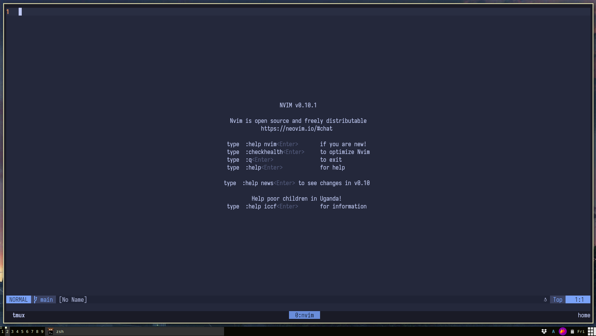

# tokisuno's Neovim Setup
Neovim 0.10+ configuration

## Installation
* `git clone` this repo into your `.config/nvim/lua` folder
* add `require('lucas')` to your `init.lua`
* that's it !

## Screenshots

